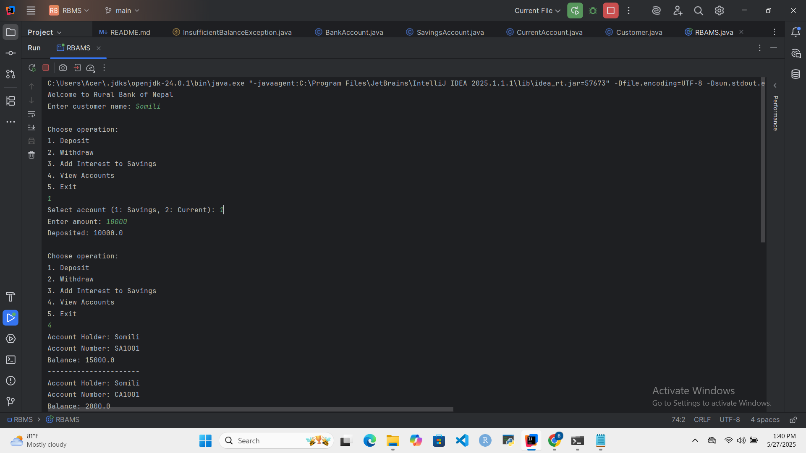
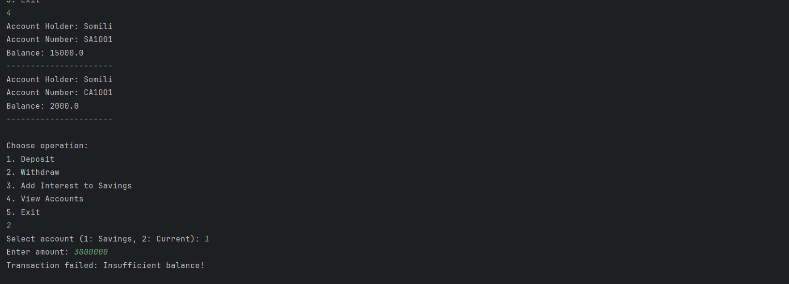
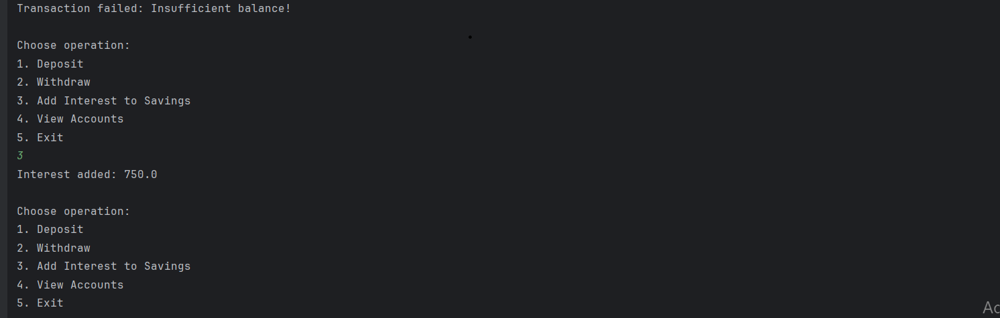

# Rural Bank Account Management System (RBAMS)

## Overview

It is a Java console application that is modeling a minimal banking system for the Rural Bank of Nepal (RBN). The application supports customer savings and current account management with Object-Oriented Programming (OOP) principles and custom exception handling illustration.

## Features

- One or more accounts for each customer.
- Handling of deposit and withdrawal transactions.
- Interest on savings accounts calculation.
- Overdraft limit handling in current accounts.
- User-defined exception throwing and handling.
- Straightforward console-based menu-driven interaction.

## Class Design and OOP Implementation

### 1. The Abstraction Class `BankAccount`

Among the members are `accountHolderName`, `accountNumber`, and `balance`.
`deposit()`, `withdraw()` (abstract), and `displayAccountDetails()` are the methods.

 An example of **inheritance** and **abstraction** 

### 2. `CurrentAccount` and `SavingsAccount`

 Extension of {BankAccount`
 The `addInterest()` method is used to add interest to the savings account.
 - `CurrentAccount`: Overdraft protection is enabled.
 By overriding `withdraw()`, **polymorphism** is demonstrated. 

### 3. `Customer`

 As an illustration of **aggregation**, this group of several `BankAccount` objects is stored.

 - Preserves client information 

### 4. `InsufficientBalanceException`

 Unauthorized withdrawals are supported by the manually built checked exception

 ### 5. `RBAMS` (Main class).

 An interface that is graphical and menu-based oversees user input and transactions.
 **Encapsulation** and exception handling are demonstrated.

## Screenshots

### 1. Deposit Operation

### 2. Withdrawal with Exception

### 3. Interest Addition

